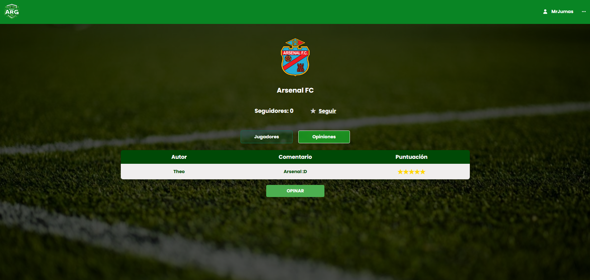

  <h1 align="center">
    Scout ARG - Web Application
     
     
      
  </h1>

 

Scout ARG is a web application designed for scouting and reviewing players from the lower divisions of Argentine football. This project allows users to search for players, view detailed profiles, and share opinions about their performances, fostering a collaborative and insightful scouting experience.  

## About This Project  

This web application was developed as part of the "Database" course in the Software Engineering program at the Faculty of Engineering, University of Buenos Aires. The project demonstrates the integration of a frontend and backend system to deliver a dynamic and user-friendly experience for exploring football talent.

## Features  
- **Search Teams**: Explore and search for information about football teams.
- **Search Players**: Filter and find players from various teams and divisions across Argentina.  
- **Player and Team Profiles**: Detailed profiles with a lot of information for both players and teams.  
- **Follow Players and Teams**: Users can follow their favorite players and teams.  
- **Community Reviews**: Share and view feedback from the football community about players and teams.

---

### Page Preview  
Below are screenshots showcasing various parts of the application:  

#### Landing Page  
This is the starting page of the application, where users can log in and start exploring:  
  

#### Teams Overview  
This section allows users to explore and filter teams, seeing the team's overall details:  
  

#### Team Profiles  
Detailed pages for each team, showcasing their players:  
  

#### Players Overview  
The section for viewing and filtering players from different teams and divisions across Argentina:  
  

#### Player Profiles  
Detailed pages displaying each player’s profile:  
  

#### Opinions and Comments  
Users can view and share opinions and feedback about teams or players’ performances:  
  

---

## Tech Stack  
- **Frontend**: Built with [React](https://reactjs.org/), delivering a responsive and dynamic user interface.  
- **Backend**: Powered by [Node.js](https://nodejs.org/) and [Supabase](https://supabase.io/) for efficient data management and seamless API integration.  
- **Database**: PostgreSQL hosted on Supabase for reliable and scalable data storage.  

## Installation and Build  

The installation and build instructions for both the **frontend** and **backend** are detailed in their respective README files:  
- [Frontend README](scout_frontend/README.md)  
- [Backend README](scout_backend/README.md)  

Please refer to those documents for step-by-step instructions to set up the application.  

## Authors  

| First Name    | Last Name   | Student ID | Gmail                  |  
| ------------- | ----------- | ---------- | ---------------------- |  
| Joaquin       | Batemarco   | 110222     | jbatemarco@fi.uba.ar   |  
| Franco Ariel  | Alani       | 111147     | falani@fi.uba.ar       |  
| Franco Martin | Fusco       | 102692     | ffusco@fi.uba.ar       |  
| Benicio       | Braunstein  | 110126     | bbraunstein@fi.uba.ar  |  
| Juan Martin   | de la Cruz  | 109588     | jdelacruz@fi.uba.ar    |  
| Theo          | Lijs        | 109472     | tlijs@fi.uba.ar        |  

### Acknowledgments  

I would like to extend a special mention to [**Joaquin Batemarco**](https://github.com/BA73C0) for their exceptional work and contributions to the development of the frontend.

Additionally, my gratitude goes to [**Theo Lijs**](https://github.com/LijsTh) for their outstanding support in ensuring the completeness and functionality of the backend. 

---  

## License  

This project is licensed under the MIT License - see the [LICENSE](LICENSE) file for details.

---  

Developed with passion for Argentine football and a commitment to technical excellence. ⚽✨  
